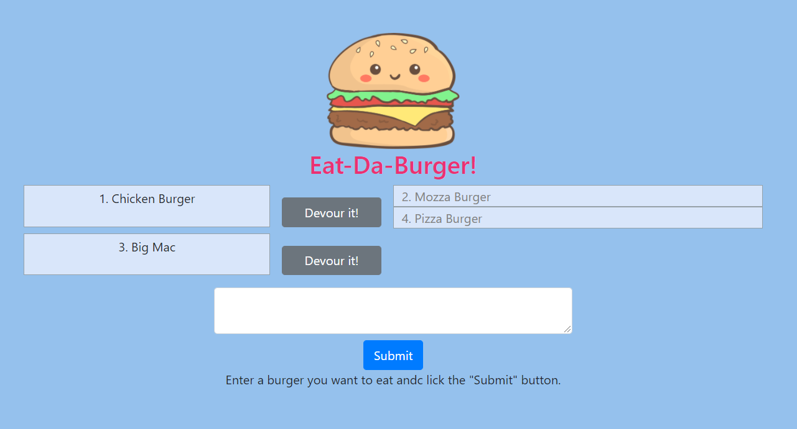

# Node-Express_Handlebars - Eat-Da-Burger!

## Description
The Eat-Da-Burger website allows users to enter burgers that they would like to eat and then 'eat' them. This application was built using a MVC design. It uses MySQL database, Express, handlebars, Node and REST API design. This application is deployed on Heroku using JawsDB as the online database.

* Link to the app on Heroku: https://guarded-sierra-90184.herokuapp.com/
* Link to the Github repository: https://github.com/akwanmtl/Burger

## Table of Contents

* [Usage](#usage)
* [Credits](#credits)
* [License](#license)

## Usage 

The website has three components:
* A form to enter the name of the burger that you would like to eat. Enter the name of the burger in the text area and hit on Submit to add the burger to the list.
* A section on the left showing the list of burgers that you have entered but not devoured. Next to each burger, there is a button name Devour it!. Click on that button to assign the burger as devoured.
* A section on the right showing the list of burgers that you have devoured.

## Credits

* [Burger Image](https://www.vippng.com/preview/ToRmoh_hamburguesa-kawaii-png-burger-picsart/)
* ORM Helper function - UofT Bootcamp Activity example on MVC
* [License badge link](https://gist.github.com/lukas-h/2a5d00690736b4c3a7ba)

## License

Copyright (c) [2020] [Annie Kwan]